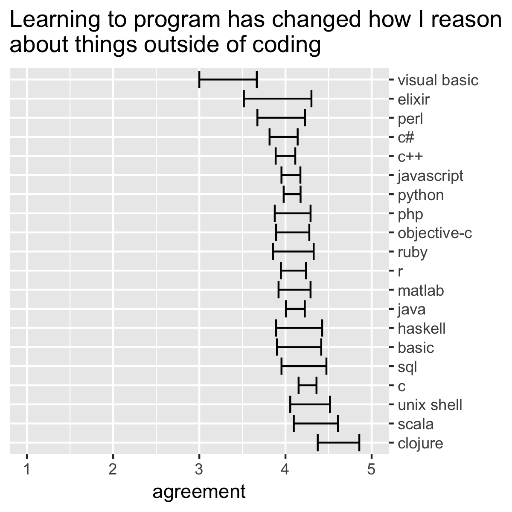
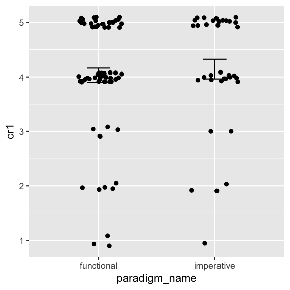
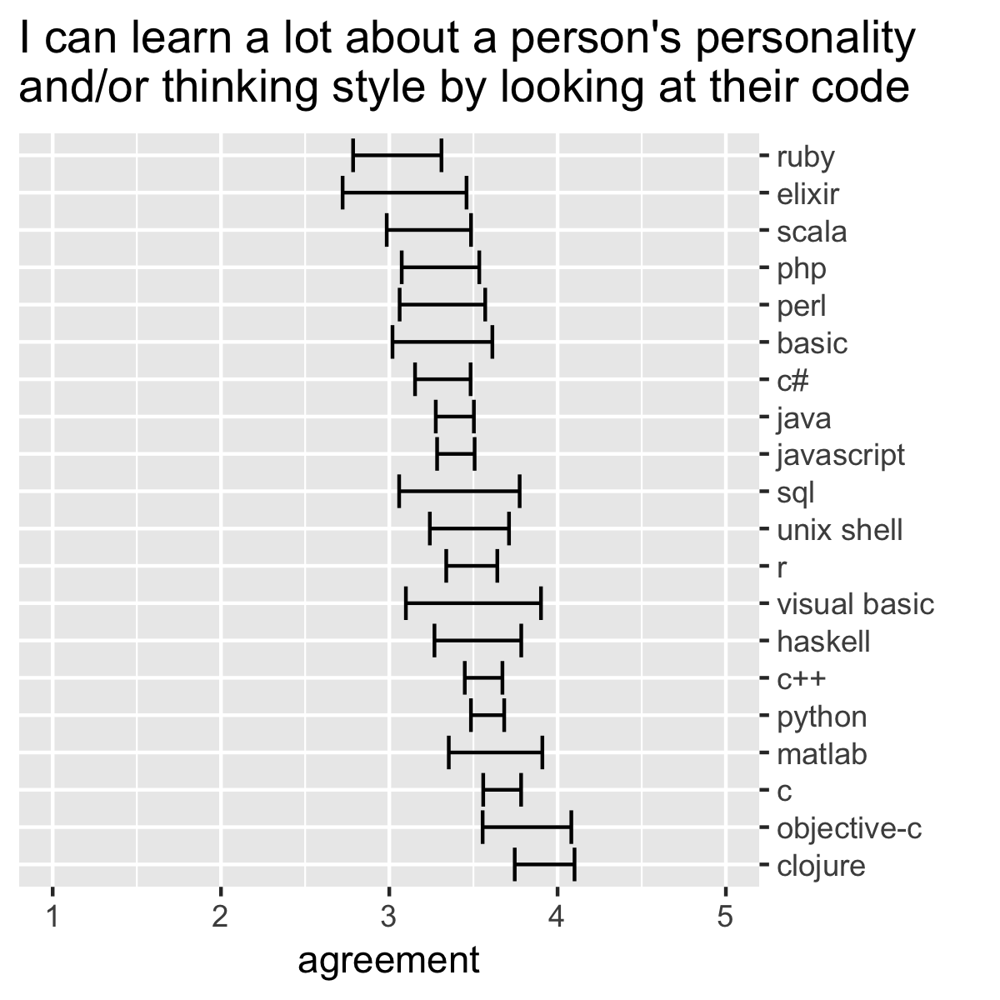
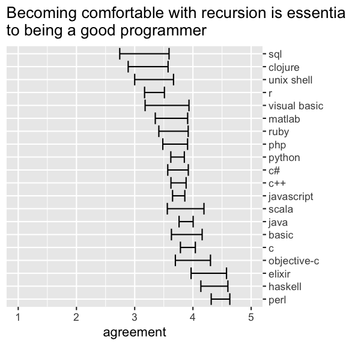
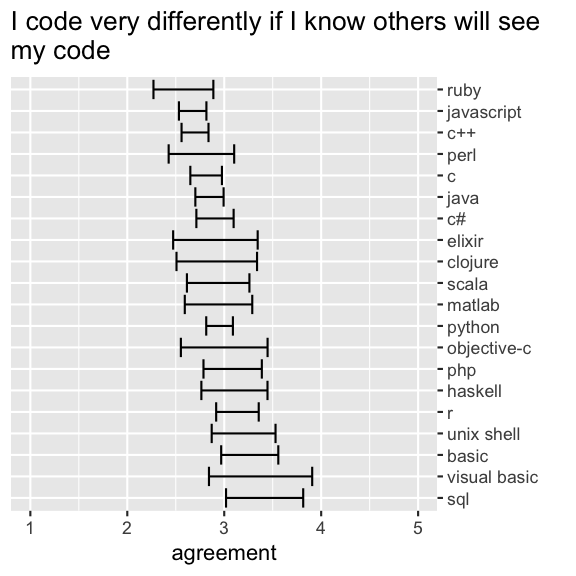
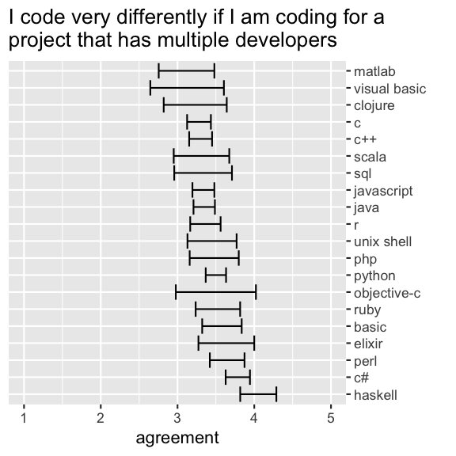
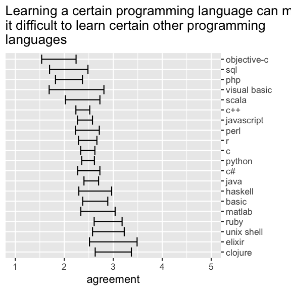
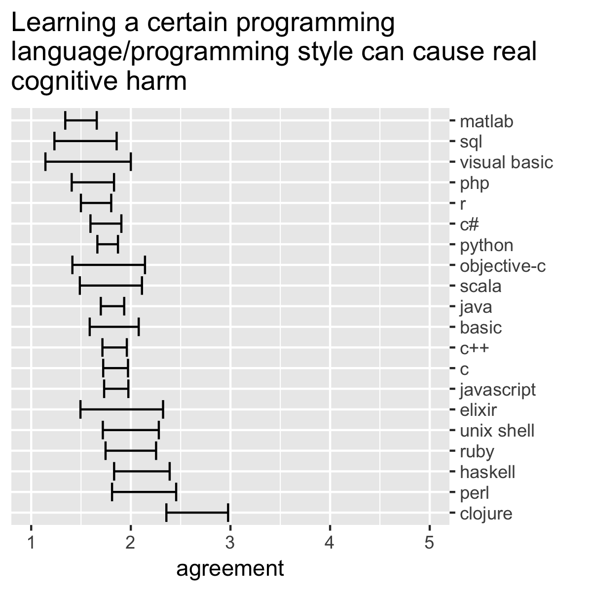

Questions
=========

<table>
<thead>
<tr class="header">
<th style="text-align: left;">question_name</th>
<th style="text-align: left;">question_text</th>
</tr>
</thead>
<tbody>
<tr class="odd">
<td style="text-align: left;">cr1</td>
<td style="text-align: left;">Learning to program has changed how I reason about things outside of coding</td>
</tr>
<tr class="even">
<td style="text-align: left;">cr1describe</td>
<td style="text-align: left;">Please elaborate. How has learning to program change how you reason about things outside of coding? If it hasn’t, please speculate why someone may think it has.</td>
</tr>
<tr class="odd">
<td style="text-align: left;">cr2describe</td>
<td style="text-align: left;">If you had to speculate, what aspect of programming do you think might have the largest effect on people’s reasoning outside of coding?</td>
</tr>
<tr class="even">
<td style="text-align: left;">cp1</td>
<td style="text-align: left;">I can learn a lot about a person’s personality and/or thinking style by looking at their code</td>
</tr>
<tr class="odd">
<td style="text-align: left;">cp1describe</td>
<td style="text-align: left;">Please elaborate on your answer above. What sorts of things about a person’s personality and/or thinking style can you learn by looking at their code. If you think you can’t, please speculate on what someone who agrees with this proposition might have in mind.</td>
</tr>
<tr class="even">
<td style="text-align: left;">repo1</td>
<td style="text-align: left;">Code repositories (e.g., GitHub) have completely transformed how I code</td>
</tr>
<tr class="odd">
<td style="text-align: left;">repo1describe</td>
<td style="text-align: left;">Please elaborate on your answer above. In what ways have code repositories changed how you code?</td>
</tr>
<tr class="even">
<td style="text-align: left;">rec1</td>
<td style="text-align: left;">Becoming comfortable with recursion is essential to being a good programmer</td>
</tr>
<tr class="odd">
<td style="text-align: left;">rec1describe</td>
<td style="text-align: left;">Can you elaborate? Do you think it is essential because it helps you think better (and if so, how?) or because there are problems that are much more easily solved using recursion?</td>
</tr>
<tr class="even">
<td style="text-align: left;">cfo1</td>
<td style="text-align: left;">I code very differently if I know others will see my code</td>
</tr>
<tr class="odd">
<td style="text-align: left;">cfo2</td>
<td style="text-align: left;">I code very differently if I am coding for a project that has multiple developers</td>
</tr>
<tr class="even">
<td style="text-align: left;">cfo3</td>
<td style="text-align: left;">Based on your experiences what effects has large-scale sharing of code via code repositories has had on people’s style of coding?</td>
</tr>
<tr class="odd">
<td style="text-align: left;">oss1</td>
<td style="text-align: left;">Open source languages tend to become easier to use as their user-base grows.</td>
</tr>
<tr class="even">
<td style="text-align: left;">oss2</td>
<td style="text-align: left;">In what ways do you think the languages become easier to use?</td>
</tr>
<tr class="odd">
<td style="text-align: left;">env1</td>
<td style="text-align: left;">Using a particular IDE (integrated development environment) can make someone a much better coder.</td>
</tr>
<tr class="even">
<td style="text-align: left;">env2</td>
<td style="text-align: left;">A module/library can only be useful to others if it is appropriately documented.</td>
</tr>
<tr class="odd">
<td style="text-align: left;">inter1</td>
<td style="text-align: left;">Learning a certain programming language can make it difficult to learn certain other programming languages</td>
</tr>
<tr class="even">
<td style="text-align: left;">inter2</td>
<td style="text-align: left;">Learning a certain programming language/programming style can cause real cognitive harm</td>
</tr>
<tr class="odd">
<td style="text-align: left;">inter3</td>
<td style="text-align: left;">What are some ways in which learning a certain language or programming style cause cognitive harm?</td>
</tr>
</tbody>
</table>

Top 20 languages
================

Changed reasoning
-----------------

Personality
-----------

Recursion
---------

Code for others
---------------

Code for team
-------------

Interference
------------

Harm
----

