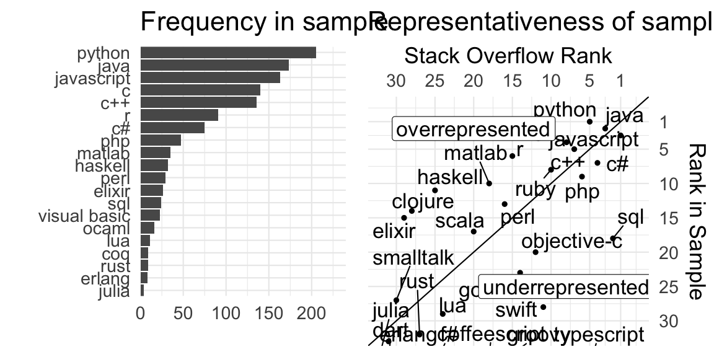
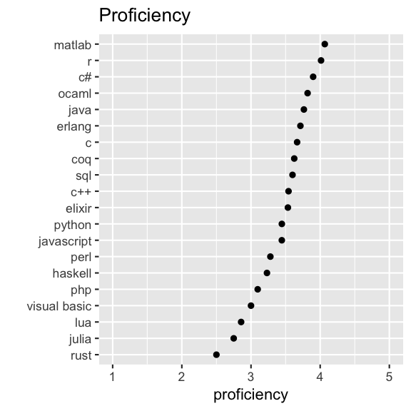
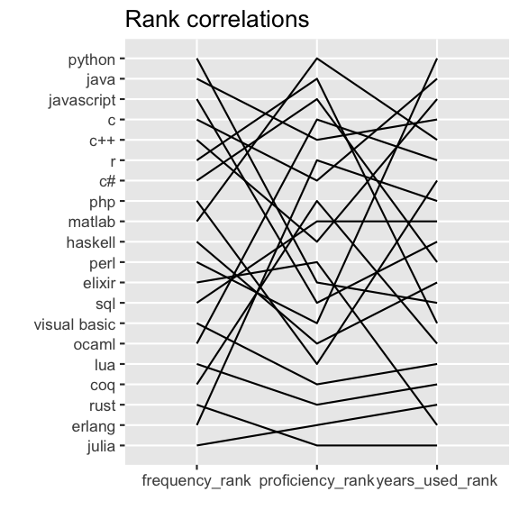
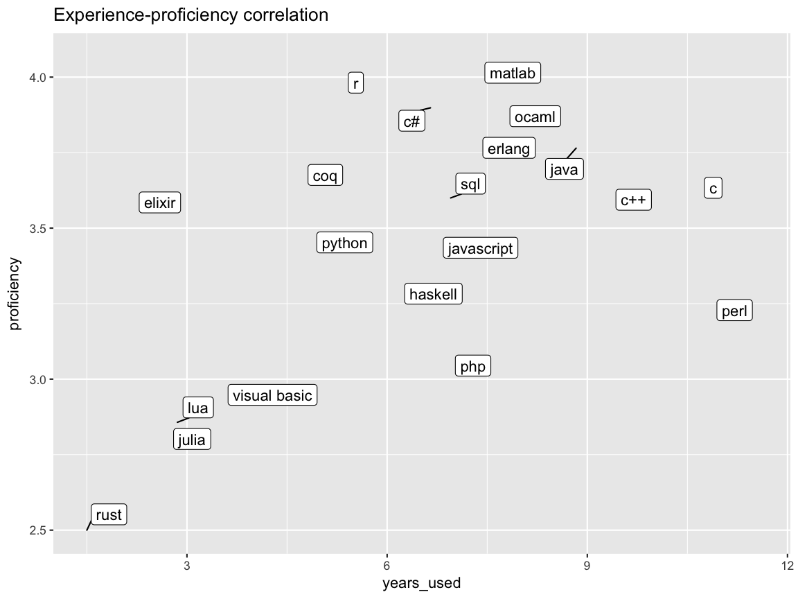
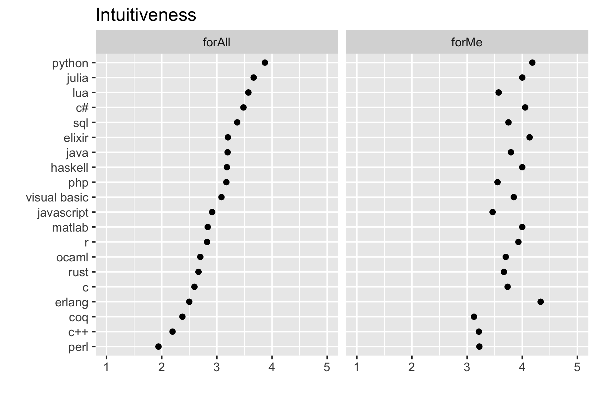
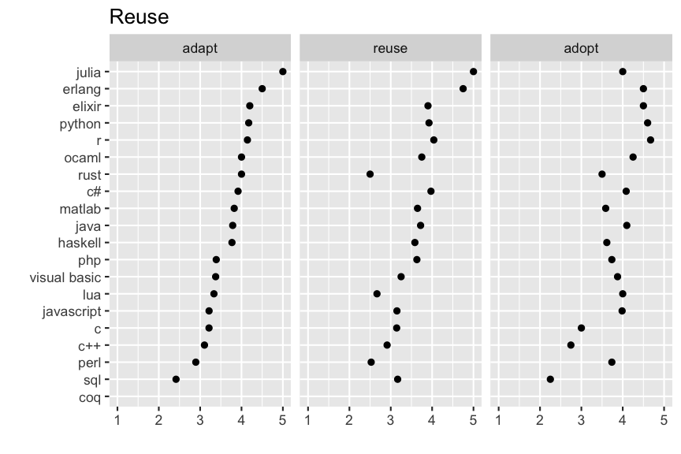
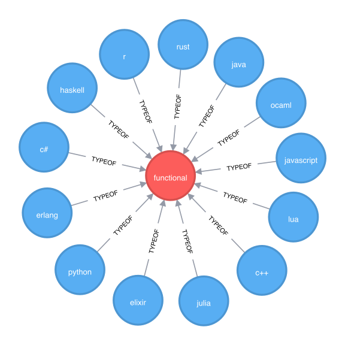
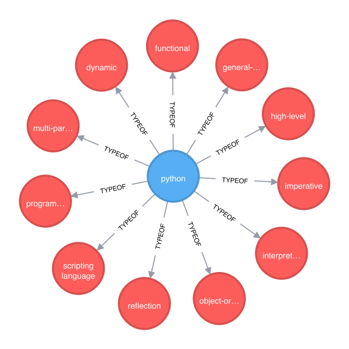
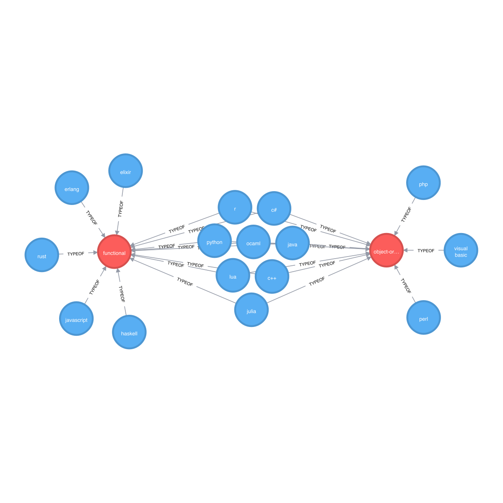
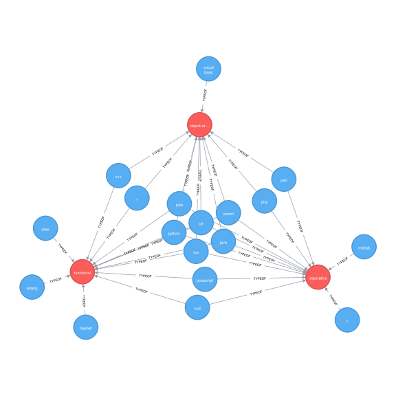

Representativeness
==================

<table>
<thead>
<tr class="header">
<th style="text-align: left;">Survey</th>
<th style="text-align: right;">N Respondents</th>
</tr>
</thead>
<tbody>
<tr class="odd">
<td style="text-align: left;">Our Survey</td>
<td style="text-align: right;">499</td>
</tr>
<tr class="even">
<td style="text-align: left;">Stack Overflow Developer Survey</td>
<td style="text-align: right;">2</td>
</tr>
</tbody>
</table>

Experience
==========

Proficiency
===========

Rank correlations
=================

Intuitiveness
=============

Reuse
=====

Programming paradigms
=====================

Functional programming languages
--------------------------------

Programming languages have many paradigms
-----------------------------------------

Functional versus imperative languages
--------------------------------------

Functional versus object-oriented languages
-------------------------------------------

Full Venn Diagram
=================

