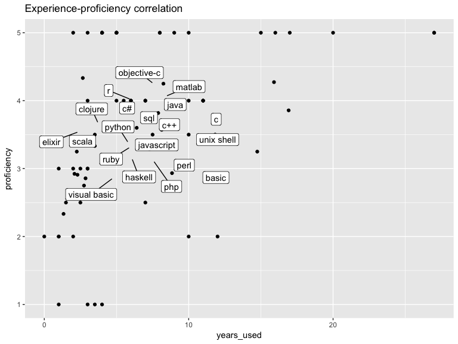

## Language frequency

<!-- -->

## Experience

<!-- -->

## Proficiency

<!-- -->

## Rank correlations

<!-- -->

<!-- -->

## Intuitiveness

<!-- -->

## Reuse

<!-- -->

## Paradigms

| paradigms                            | n\_top20 | pct\_top20 | n\_all |  pct\_all |
| :----------------------------------- | -------: | ---------: | -----: | --------: |
| multi-paradigm programming language  |       11 |  0.1410256 |     27 | 0.1111111 |
| programming language                 |       10 |  0.1282051 |     51 | 0.2098765 |
| imperative programming language      |        8 |  0.1025641 |     20 | 0.0823045 |
| object-oriented programming language |        8 |  0.1025641 |     24 | 0.0987654 |
| functional programming language      |        7 |  0.0897436 |     24 | 0.0987654 |
| interpreted language                 |        7 |  0.0897436 |     15 | 0.0617284 |
| procedural programming language      |        5 |  0.0641026 |     18 | 0.0740741 |
| scripting language                   |        3 |  0.0384615 |      7 | 0.0288066 |

| language\_name | n\_top8\_paradigms |
| :------------- | -----------------: |
| basic          |                  2 |
| c              |                  3 |
| c\#            |                  1 |
| c++            |                  5 |
| clojure        |                  2 |
| elixir         |                  2 |
| haskell        |                  1 |
| java           |                  1 |
| javascript     |                  5 |
| matlab         |                  2 |
| objective-c    |                  3 |
| perl           |                  6 |
| php            |                  6 |
| python         |                  7 |
| r              |                  1 |
| ruby           |                  6 |
| scala          |                  3 |
| visual basic   |                  3 |
