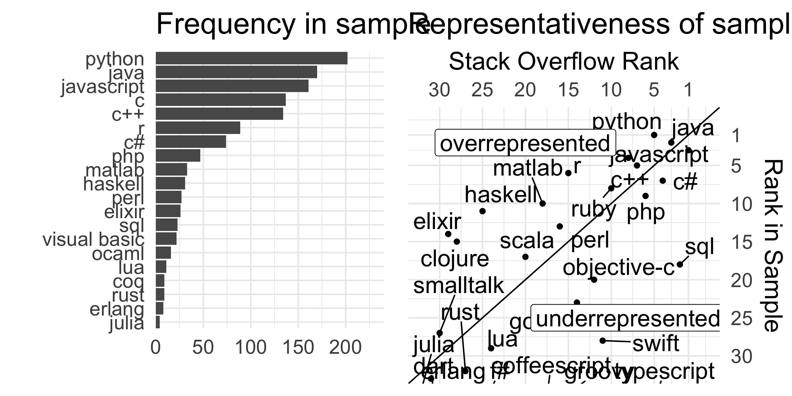

Representativeness
------------------

<table>
<thead>
<tr class="header">
<th style="text-align: left;">Survey</th>
<th style="text-align: right;">N Respondents</th>
</tr>
</thead>
<tbody>
<tr class="odd">
<td style="text-align: left;">Our Survey</td>
<td style="text-align: right;">499</td>
</tr>
<tr class="even">
<td style="text-align: left;">Stack Overflow Developer Survey</td>
<td style="text-align: right;">2</td>
</tr>
</tbody>
</table>

Experience
----------

Proficiency
-----------

Rank correlations
-----------------

Intuitiveness
-------------

Reuse
-----

Paradigms
---------

<table>
<thead>
<tr class="header">
<th style="text-align: left;">paradigm_name</th>
<th style="text-align: right;">n_top20</th>
<th style="text-align: right;">pct_top20</th>
<th style="text-align: right;">n_all</th>
<th style="text-align: right;">pct_all</th>
</tr>
</thead>
<tbody>
<tr class="odd">
<td style="text-align: left;">functional</td>
<td style="text-align: right;">13</td>
<td style="text-align: right;">0.1056911</td>
<td style="text-align: right;">13</td>
<td style="text-align: right;">0.1056911</td>
</tr>
<tr class="even">
<td style="text-align: left;">multi-paradigm</td>
<td style="text-align: right;">13</td>
<td style="text-align: right;">0.1056911</td>
<td style="text-align: right;">13</td>
<td style="text-align: right;">0.1056911</td>
</tr>
<tr class="odd">
<td style="text-align: left;">imperative</td>
<td style="text-align: right;">12</td>
<td style="text-align: right;">0.0975610</td>
<td style="text-align: right;">12</td>
<td style="text-align: right;">0.0975610</td>
</tr>
<tr class="even">
<td style="text-align: left;">object-oriented</td>
<td style="text-align: right;">11</td>
<td style="text-align: right;">0.0894309</td>
<td style="text-align: right;">11</td>
<td style="text-align: right;">0.0894309</td>
</tr>
<tr class="odd">
<td style="text-align: left;">programming language</td>
<td style="text-align: right;">11</td>
<td style="text-align: right;">0.0894309</td>
<td style="text-align: right;">11</td>
<td style="text-align: right;">0.0894309</td>
</tr>
<tr class="even">
<td style="text-align: left;">interpreted language</td>
<td style="text-align: right;">8</td>
<td style="text-align: right;">0.0650407</td>
<td style="text-align: right;">8</td>
<td style="text-align: right;">0.0650407</td>
</tr>
<tr class="odd">
<td style="text-align: left;">procedural</td>
<td style="text-align: right;">7</td>
<td style="text-align: right;">0.0569106</td>
<td style="text-align: right;">7</td>
<td style="text-align: right;">0.0569106</td>
</tr>
<tr class="even">
<td style="text-align: left;">scripting language</td>
<td style="text-align: right;">4</td>
<td style="text-align: right;">0.0325203</td>
<td style="text-align: right;">4</td>
<td style="text-align: right;">0.0325203</td>
</tr>
</tbody>
</table>

<table>
<thead>
<tr class="header">
<th style="text-align: left;">language_name</th>
<th style="text-align: left;">paradigm_name</th>
</tr>
</thead>
<tbody>
<tr class="odd">
<td style="text-align: left;">javascript</td>
<td style="text-align: left;">scripting language</td>
</tr>
<tr class="even">
<td style="text-align: left;">javascript</td>
<td style="text-align: left;">computing platform</td>
</tr>
<tr class="odd">
<td style="text-align: left;">javascript</td>
<td style="text-align: left;">interpreted language</td>
</tr>
<tr class="even">
<td style="text-align: left;">javascript</td>
<td style="text-align: left;">multi-paradigm</td>
</tr>
<tr class="odd">
<td style="text-align: left;">javascript</td>
<td style="text-align: left;">prototype-based</td>
</tr>
<tr class="even">
<td style="text-align: left;">javascript</td>
<td style="text-align: left;">imperative</td>
</tr>
<tr class="odd">
<td style="text-align: left;">javascript</td>
<td style="text-align: left;">functional</td>
</tr>
<tr class="even">
<td style="text-align: left;">javascript</td>
<td style="text-align: left;">event-driven</td>
</tr>
<tr class="odd">
<td style="text-align: left;">perl</td>
<td style="text-align: left;">programming language</td>
</tr>
<tr class="even">
<td style="text-align: left;">perl</td>
<td style="text-align: left;">procedural</td>
</tr>
<tr class="odd">
<td style="text-align: left;">perl</td>
<td style="text-align: left;">object-oriented</td>
</tr>
<tr class="even">
<td style="text-align: left;">perl</td>
<td style="text-align: left;">multi-paradigm</td>
</tr>
<tr class="odd">
<td style="text-align: left;">perl</td>
<td style="text-align: left;">imperative</td>
</tr>
<tr class="even">
<td style="text-align: left;">perl</td>
<td style="text-align: left;">interpreted language</td>
</tr>
<tr class="odd">
<td style="text-align: left;">ocaml</td>
<td style="text-align: left;">object-oriented</td>
</tr>
<tr class="even">
<td style="text-align: left;">ocaml</td>
<td style="text-align: left;">functional</td>
</tr>
<tr class="odd">
<td style="text-align: left;">ocaml</td>
<td style="text-align: left;">multi-paradigm</td>
</tr>
<tr class="even">
<td style="text-align: left;">ocaml</td>
<td style="text-align: left;">imperative</td>
</tr>
<tr class="odd">
<td style="text-align: left;">java</td>
<td style="text-align: left;">multi-paradigm</td>
</tr>
<tr class="even">
<td style="text-align: left;">haskell</td>
<td style="text-align: left;">purely functional</td>
</tr>
<tr class="odd">
<td style="text-align: left;">haskell</td>
<td style="text-align: left;">lazy evaluation</td>
</tr>
<tr class="even">
<td style="text-align: left;">haskell</td>
<td style="text-align: left;">non-strict</td>
</tr>
<tr class="odd">
<td style="text-align: left;">haskell</td>
<td style="text-align: left;">modular</td>
</tr>
<tr class="even">
<td style="text-align: left;">haskell</td>
<td style="text-align: left;">interpreted language</td>
</tr>
<tr class="odd">
<td style="text-align: left;">c</td>
<td style="text-align: left;">programming language</td>
</tr>
<tr class="even">
<td style="text-align: left;">c</td>
<td style="text-align: left;">imperative</td>
</tr>
<tr class="odd">
<td style="text-align: left;">c</td>
<td style="text-align: left;">procedural</td>
</tr>
<tr class="even">
<td style="text-align: left;">c</td>
<td style="text-align: left;">structured</td>
</tr>
<tr class="odd">
<td style="text-align: left;">c++</td>
<td style="text-align: left;">object-oriented</td>
</tr>
<tr class="even">
<td style="text-align: left;">c++</td>
<td style="text-align: left;">multi-paradigm</td>
</tr>
<tr class="odd">
<td style="text-align: left;">c++</td>
<td style="text-align: left;">procedural</td>
</tr>
<tr class="even">
<td style="text-align: left;">c++</td>
<td style="text-align: left;">functional</td>
</tr>
<tr class="odd">
<td style="text-align: left;">c++</td>
<td style="text-align: left;">generic</td>
</tr>
<tr class="even">
<td style="text-align: left;">c++</td>
<td style="text-align: left;">programming language</td>
</tr>
<tr class="odd">
<td style="text-align: left;">c#</td>
<td style="text-align: left;">multi-paradigm</td>
</tr>
<tr class="even">
<td style="text-align: left;">lua</td>
<td style="text-align: left;">functional</td>
</tr>
<tr class="odd">
<td style="text-align: left;">lua</td>
<td style="text-align: left;">object-oriented</td>
</tr>
<tr class="even">
<td style="text-align: left;">lua</td>
<td style="text-align: left;">scripting language</td>
</tr>
<tr class="odd">
<td style="text-align: left;">lua</td>
<td style="text-align: left;">programming language</td>
</tr>
<tr class="even">
<td style="text-align: left;">lua</td>
<td style="text-align: left;">multi-paradigm</td>
</tr>
<tr class="odd">
<td style="text-align: left;">lua</td>
<td style="text-align: left;">imperative</td>
</tr>
<tr class="even">
<td style="text-align: left;">lua</td>
<td style="text-align: left;">procedural</td>
</tr>
<tr class="odd">
<td style="text-align: left;">lua</td>
<td style="text-align: left;">prototype-based</td>
</tr>
<tr class="even">
<td style="text-align: left;">lua</td>
<td style="text-align: left;">interpreted language</td>
</tr>
<tr class="odd">
<td style="text-align: left;">r</td>
<td style="text-align: left;">GNU package</td>
</tr>
<tr class="even">
<td style="text-align: left;">r</td>
<td style="text-align: left;">multi-paradigm</td>
</tr>
<tr class="odd">
<td style="text-align: left;">r</td>
<td style="text-align: left;">statistical package</td>
</tr>
<tr class="even">
<td style="text-align: left;">julia</td>
<td style="text-align: left;">programming language</td>
</tr>
<tr class="odd">
<td style="text-align: left;">julia</td>
<td style="text-align: left;">object-oriented</td>
</tr>
<tr class="even">
<td style="text-align: left;">julia</td>
<td style="text-align: left;">functional</td>
</tr>
<tr class="odd">
<td style="text-align: left;">julia</td>
<td style="text-align: left;">array</td>
</tr>
<tr class="even">
<td style="text-align: left;">julia</td>
<td style="text-align: left;">multi-paradigm</td>
</tr>
<tr class="odd">
<td style="text-align: left;">julia</td>
<td style="text-align: left;">imperative</td>
</tr>
<tr class="even">
<td style="text-align: left;">julia</td>
<td style="text-align: left;">interpreted language</td>
</tr>
<tr class="odd">
<td style="text-align: left;">matlab</td>
<td style="text-align: left;">array</td>
</tr>
<tr class="even">
<td style="text-align: left;">matlab</td>
<td style="text-align: left;">imperative</td>
</tr>
<tr class="odd">
<td style="text-align: left;">matlab</td>
<td style="text-align: left;">interpreted language</td>
</tr>
<tr class="even">
<td style="text-align: left;">visual basic</td>
<td style="text-align: left;">programming language</td>
</tr>
<tr class="odd">
<td style="text-align: left;">visual basic</td>
<td style="text-align: left;">event-driven</td>
</tr>
<tr class="even">
<td style="text-align: left;">visual basic</td>
<td style="text-align: left;">procedural</td>
</tr>
<tr class="odd">
<td style="text-align: left;">visual basic</td>
<td style="text-align: left;">object-oriented</td>
</tr>
<tr class="even">
<td style="text-align: left;">php</td>
<td style="text-align: left;">scripting language</td>
</tr>
<tr class="odd">
<td style="text-align: left;">php</td>
<td style="text-align: left;">procedural</td>
</tr>
<tr class="even">
<td style="text-align: left;">php</td>
<td style="text-align: left;">object-oriented</td>
</tr>
<tr class="odd">
<td style="text-align: left;">php</td>
<td style="text-align: left;">multi-paradigm</td>
</tr>
<tr class="even">
<td style="text-align: left;">php</td>
<td style="text-align: left;">imperative</td>
</tr>
<tr class="odd">
<td style="text-align: left;">php</td>
<td style="text-align: left;">interpreted language</td>
</tr>
<tr class="even">
<td style="text-align: left;">python</td>
<td style="text-align: left;">object-oriented</td>
</tr>
<tr class="odd">
<td style="text-align: left;">python</td>
<td style="text-align: left;">dynamic</td>
</tr>
<tr class="even">
<td style="text-align: left;">python</td>
<td style="text-align: left;">functional</td>
</tr>
<tr class="odd">
<td style="text-align: left;">python</td>
<td style="text-align: left;">scripting language</td>
</tr>
<tr class="even">
<td style="text-align: left;">python</td>
<td style="text-align: left;">multi-paradigm</td>
</tr>
<tr class="odd">
<td style="text-align: left;">python</td>
<td style="text-align: left;">imperative</td>
</tr>
<tr class="even">
<td style="text-align: left;">python</td>
<td style="text-align: left;">interpreted language</td>
</tr>
<tr class="odd">
<td style="text-align: left;">python</td>
<td style="text-align: left;">general-purpose</td>
</tr>
<tr class="even">
<td style="text-align: left;">python</td>
<td style="text-align: left;">high-level</td>
</tr>
<tr class="odd">
<td style="text-align: left;">python</td>
<td style="text-align: left;">programming language</td>
</tr>
<tr class="even">
<td style="text-align: left;">elixir</td>
<td style="text-align: left;">functional</td>
</tr>
<tr class="odd">
<td style="text-align: left;">elixir</td>
<td style="text-align: left;">programming language</td>
</tr>
<tr class="even">
<td style="text-align: left;">erlang</td>
<td style="text-align: left;">programming language</td>
</tr>
<tr class="odd">
<td style="text-align: left;">erlang</td>
<td style="text-align: left;">multi-paradigm</td>
</tr>
<tr class="even">
<td style="text-align: left;">erlang</td>
<td style="text-align: left;">concurrent</td>
</tr>
<tr class="odd">
<td style="text-align: left;">erlang</td>
<td style="text-align: left;">functional</td>
</tr>
<tr class="even">
<td style="text-align: left;">erlang</td>
<td style="text-align: left;">declarative</td>
</tr>
<tr class="odd">
<td style="text-align: left;">sql</td>
<td style="text-align: left;">declarative</td>
</tr>
<tr class="even">
<td style="text-align: left;">sql</td>
<td style="text-align: left;">query language</td>
</tr>
<tr class="odd">
<td style="text-align: left;">sql</td>
<td style="text-align: left;">file format</td>
</tr>
<tr class="even">
<td style="text-align: left;">sql</td>
<td style="text-align: left;">programming language</td>
</tr>
<tr class="odd">
<td style="text-align: left;">coq</td>
<td style="text-align: left;">programming language</td>
</tr>
<tr class="even">
<td style="text-align: left;">coq</td>
<td style="text-align: left;">proof assistant</td>
</tr>
<tr class="odd">
<td style="text-align: left;">coq</td>
<td style="text-align: left;">purely functional</td>
</tr>
<tr class="even">
<td style="text-align: left;">rust</td>
<td style="text-align: left;">procedural</td>
</tr>
<tr class="odd">
<td style="text-align: left;">rust</td>
<td style="text-align: left;">functional</td>
</tr>
<tr class="even">
<td style="text-align: left;">rust</td>
<td style="text-align: left;">multi-paradigm</td>
</tr>
<tr class="odd">
<td style="text-align: left;">rust</td>
<td style="text-align: left;">imperative</td>
</tr>
<tr class="even">
<td style="text-align: left;">rust</td>
<td style="text-align: left;">System</td>
</tr>
<tr class="odd">
<td style="text-align: left;">java</td>
<td style="text-align: left;">structured</td>
</tr>
<tr class="even">
<td style="text-align: left;">java</td>
<td style="text-align: left;">object-oriented</td>
</tr>
<tr class="odd">
<td style="text-align: left;">java</td>
<td style="text-align: left;">functional</td>
</tr>
<tr class="even">
<td style="text-align: left;">java</td>
<td style="text-align: left;">generic</td>
</tr>
<tr class="odd">
<td style="text-align: left;">java</td>
<td style="text-align: left;">imperative</td>
</tr>
<tr class="even">
<td style="text-align: left;">java</td>
<td style="text-align: left;">concurrent computing</td>
</tr>
<tr class="odd">
<td style="text-align: left;">java</td>
<td style="text-align: left;">class-based</td>
</tr>
<tr class="even">
<td style="text-align: left;">java</td>
<td style="text-align: left;">concurrent object-oriented</td>
</tr>
<tr class="odd">
<td style="text-align: left;">java</td>
<td style="text-align: left;">reflective</td>
</tr>
<tr class="even">
<td style="text-align: left;">haskell</td>
<td style="text-align: left;">functional</td>
</tr>
<tr class="odd">
<td style="text-align: left;">c#</td>
<td style="text-align: left;">structured</td>
</tr>
<tr class="even">
<td style="text-align: left;">c#</td>
<td style="text-align: left;">imperative</td>
</tr>
<tr class="odd">
<td style="text-align: left;">c#</td>
<td style="text-align: left;">object-oriented</td>
</tr>
<tr class="even">
<td style="text-align: left;">c#</td>
<td style="text-align: left;">event-driven</td>
</tr>
<tr class="odd">
<td style="text-align: left;">c#</td>
<td style="text-align: left;">functional</td>
</tr>
<tr class="even">
<td style="text-align: left;">c#</td>
<td style="text-align: left;">generic</td>
</tr>
<tr class="odd">
<td style="text-align: left;">c#</td>
<td style="text-align: left;">reflective</td>
</tr>
<tr class="even">
<td style="text-align: left;">c#</td>
<td style="text-align: left;">concurrent computing</td>
</tr>
<tr class="odd">
<td style="text-align: left;">c#</td>
<td style="text-align: left;">class-based</td>
</tr>
<tr class="even">
<td style="text-align: left;">r</td>
<td style="text-align: left;">functional</td>
</tr>
<tr class="odd">
<td style="text-align: left;">r</td>
<td style="text-align: left;">array</td>
</tr>
<tr class="even">
<td style="text-align: left;">r</td>
<td style="text-align: left;">object-oriented</td>
</tr>
<tr class="odd">
<td style="text-align: left;">visual basic</td>
<td style="text-align: left;">Object-based language</td>
</tr>
<tr class="even">
<td style="text-align: left;">python</td>
<td style="text-align: left;">reflection</td>
</tr>
<tr class="odd">
<td style="text-align: left;">erlang</td>
<td style="text-align: left;">concurrent computing</td>
</tr>
<tr class="even">
<td style="text-align: left;">coq</td>
<td style="text-align: left;">purely functional</td>
</tr>
<tr class="odd">
<td style="text-align: left;">rust</td>
<td style="text-align: left;">compiled language</td>
</tr>
</tbody>
</table>
