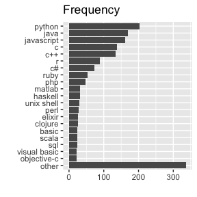
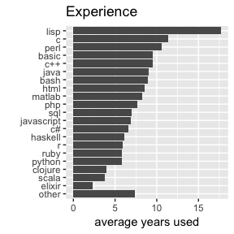
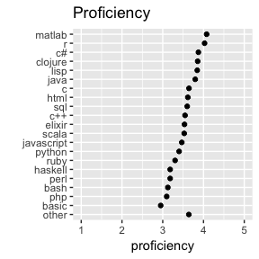
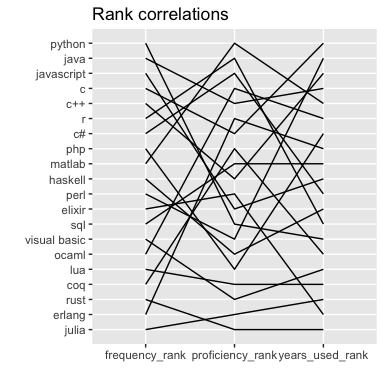
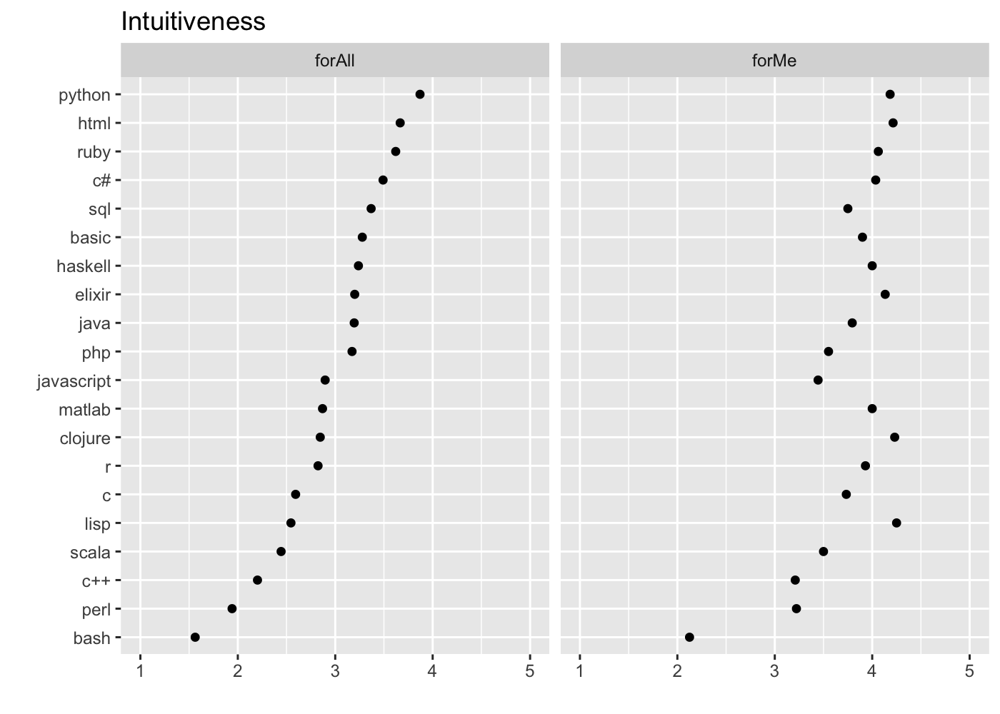
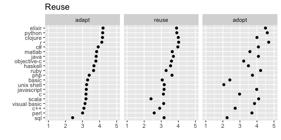

# Top languages

``` r
source("R/sqlite.R")
languages <- collect_table("languages")
```

| subj\_id           | language\_ix | language\_name | age\_started | proficiency | years\_used |
| :----------------- | -----------: | :------------- | -----------: | ----------: | ----------: |
| R\_02lGHY18refVcJj |            1 | javascript     |           30 |           5 |          20 |
| R\_02lGHY18refVcJj |            2 | perl           |           30 |           4 |          15 |
| R\_02lGHY18refVcJj |            3 | ocaml          |           47 |           4 |           3 |
| R\_02lGHY18refVcJj |            4 | java           |           38 |           3 |           7 |
| R\_02lGHY18refVcJj |            5 | haskell        |           47 |           4 |           3 |
| R\_08jNDkIvkIto1tT |            1 | c              |           18 |           5 |           8 |

## Frequency

<!-- -->

## Experience

<!-- -->

## Proficiency

<!-- -->

## Rank correlations

<!-- -->

# Language ratings

``` r
language_ratings <- collect_table("language_ratings")
```

| subj\_id           | question\_name | language\_ix | language\_name | question\_tag | agreement\_str             | agreement\_num | agreement\_label           |
| :----------------- | :------------- | -----------: | :------------- | :------------ | :------------------------- | -------------: | :------------------------- |
| R\_02lGHY18refVcJj | intuitiveness  |            1 | javascript     | forAll        | Neither agree nor disagree |              3 | Neither agree nor disagree |
| R\_02lGHY18refVcJj | intuitiveness  |            2 | perl           | forAll        | Neither agree nor disagree |              3 | Neither agree nor disagree |
| R\_02lGHY18refVcJj | intuitiveness  |            3 | ocaml          | forAll        | Neither agree nor disagree |              3 | Neither agree nor disagree |
| R\_02lGHY18refVcJj | intuitiveness  |            4 | java           | forAll        | Neither agree nor disagree |              3 | Neither agree nor disagree |
| R\_02lGHY18refVcJj | intuitiveness  |            5 | haskell        | forAll        | Neither agree nor disagree |              3 | Neither agree nor disagree |
| R\_08jNDkIvkIto1tT | intuitiveness  |            1 | c              | forAll        | Somewhat agree             |              4 | Somewhat agree             |

## Intuitiveness

<!-- -->

## Reuse

    ## Joining, by = "question_tag"

<!-- -->
